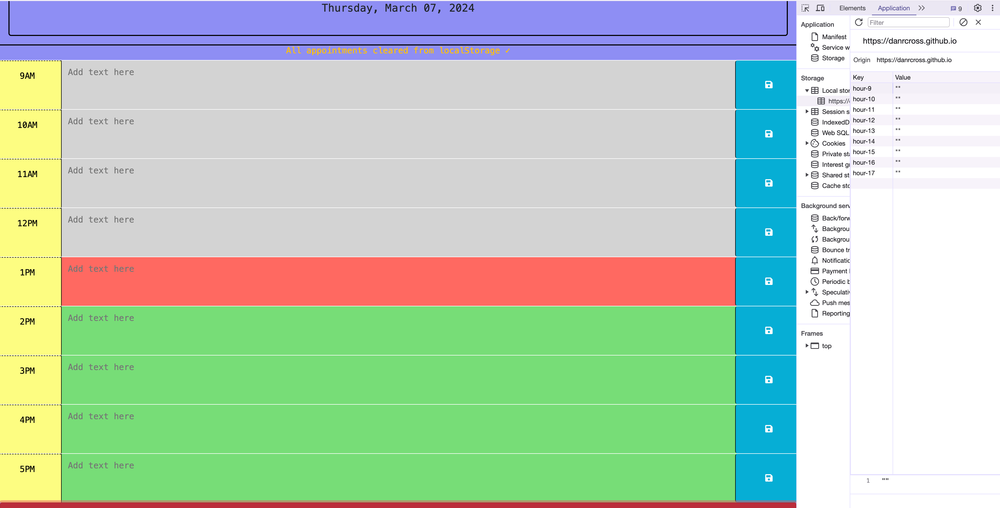

#  Daniel's Work Day Scheduler

## Description

The goal here was to create a website that will function as a work-day scheduler (a daily planner). The page should list the user's tasks for each hour. Each time-block should have a save button that saves the text that the user input for that time-block. The text should be saved into localStorage. When the user reloads/revisits the page, their time-blocks should update with the text that was previously saved there. 

I was given the beginnings of some code for this. The HTML structure was already outlined, and the structure of the time-blocks was provided. The HTML was already linked to the Bootstrap CSS library, which the given time-block calls upon. I used this time-block code as a jumping off point. 

I accomplished the aforementioned goals. I also added some perks: a "Clear All" button that clears all appointments (text areas); a notification function, that displays a notification for 5 seconds whenever the user clicks either a save button or the "Clear All" button, notifying the user that they have altered the local storage.

The JavaScript is my own. Of course, I sought help from the web for certain topics I needed to better comprehend. I cite those helpers below.

Through this project, I had the opportunity to practice and solidify my previously acquired development skills, as well as the following new skills: 
- jQuery syntax: DOM traversal (.parent(), .children(), .attr(), etc.)
- 3rd party API implementation (jQuery, Bootstrap, Day.js)
- .map() method 
- .get() method
- .addClass() and .removeClass() 
- use of 'this' as a means of event delegation 
- .val()

## Installation

Visit this page to use the application: https://danrcross.github.io/daniel-daily-planner/

## Usage

Here are some demonstrations of the site's design and functionality:

The basic layout:

Text entered: 

Item saved; notification displayed:

Data saved to local storage:

"Clear All" button: 

"Clear All" has replaced local storage items with empty strings; notification appears:

## Credits

Thank you to GitHub user 'crispy-octo-meme' for your starter code: https://github.com/coding-boot-camp/crispy-octo-meme

APIs used: 
- jQuery: https://cdnjs.cloudflare.com/ajax/libs/jquery/3.2.1/jquery.min.js
- Bootstrap: https://cdn.jsdelivr.net/npm/bootstrap@5.1.3/dist/css/bootstrap.min.css
- Day.js: https://cdn.jsdelivr.net/npm/dayjs@1/dayjs.min.js
- Day.js plugin: https://cdn.jsdelivr.net/npm/dayjs@1/plugin/utc.js
- Day.js 'CustomParseFormat' plugin: https://cdnjs.cloudflare.com/ajax/libs/dayjs/1.11.10/plugin/customParseFormat.min.js

Credits for help understanding certain topics:
- on using CustomParseFormat plugin of day.js: https://day.js.org/docs/en/plugin/custom-parse-format 
--https://day.js.org/docs/en/parse/string-format

- The Xpert Learning Assistant (AI helper) helped me to understand the following topics:
    - Using .map() and .get() as methods to traverse/manipulate the DOM, and generate an array based on certain values found in the DOM.
    - Using a CDN as a way of accessing the Day.js plugin that I wanted to use in this project

## License

MIT License

Copyright (c) 2024 Daniel Cross

Permission is hereby granted, free of charge, to any person obtaining a copy
of this software and associated documentation files (the "Software"), to deal
in the Software without restriction, including without limitation the rights
to use, copy, modify, merge, publish, distribute, sublicense, and/or sell
copies of the Software, and to permit persons to whom the Software is
furnished to do so, subject to the following conditions:

The above copyright notice and this permission notice shall be included in all
copies or substantial portions of the Software.

THE SOFTWARE IS PROVIDED "AS IS", WITHOUT WARRANTY OF ANY KIND, EXPRESS OR
IMPLIED, INCLUDING BUT NOT LIMITED TO THE WARRANTIES OF MERCHANTABILITY,
FITNESS FOR A PARTICULAR PURPOSE AND NONINFRINGEMENT. IN NO EVENT SHALL THE
AUTHORS OR COPYRIGHT HOLDERS BE LIABLE FOR ANY CLAIM, DAMAGES OR OTHER
LIABILITY, WHETHER IN AN ACTION OF CONTRACT, TORT OR OTHERWISE, ARISING FROM,
OUT OF OR IN CONNECTION WITH THE SOFTWARE OR THE USE OR OTHER DEALINGS IN THE
SOFTWARE.

